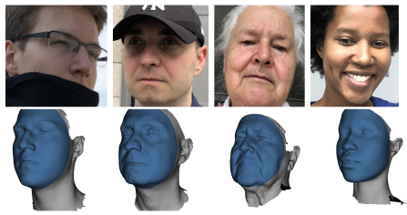

# NoW Evaluation

This is the official repository for evaluation on the [NoW Benchmark Dataset](https://ringnet.is.tue.mpg.de/challenge). The goal of the NoW benchmark is to introduce a standard evaluation metric to measure the accuracy and robustness of 3D face reconstruction methods from a single image under variations in viewing angle, lighting, and common occlusions. 

<p align="center"> 

</p>

## Evaluation metric

Given a single monocular image, the challenge consists of reconstructing a 3D face. Since the predicted meshes occur in different local coordinate systems, the reconstructed 3D mesh is rigidly aligned (rotation, translation, and scaling) to the scan using a set of corresponding landmarks between the prediction and the scan. We further perform a rigid alignment based on the scan-to-mesh distance (which is the absolute distance between each scan vertex and the closest point in the mesh surface) between the ground truth scan, and the reconstructed mesh using the landmarks alignment as initialization. For more details, see the [NoW Website](https://ringnet.is.tue.mpg.de/challenge) or the [RingNet paper](https://ps.is.tuebingen.mpg.de/uploads_file/attachment/attachment/509/paper_camera_ready.pdf).

```
Learning to Regress 3D Face Shape and Expression from an Image without 3D Supervision
Soubhik Sanyal, Timo Bolkart, Haiwen Feng, Michael J. Black
Computer Vision and Pattern Recognition (CVPR) 2019
```

## Clone the repository 
```
git clone https://github.com/soubhiksanyal/now_evaluation.git
```
## Installation

Please install the virtual environment

```
mkdir <your_home_dir>/.virtualenvs
python3 -m venv <your_home_dir>/.virtualenvs/now_evaluation
source <your_home_dir>/.virtualenvs/now_evaluation/bin/activate
```

Make sure your pip version is up-to-date:
```
pip install -U pip
```

Install the requirements by using:

```
pip install -r requirements.txt
```

Install mesh processing libraries from [MPI-IS/mesh](https://github.com/MPI-IS/mesh) within the virtual environment.

### Installing Scan2Mesh distance:

Clone the [flame-fitting](https://github.com/Rubikplayer/flame-fitting) repository and copy the required folders by the following comments

```
git clone https://github.com/Rubikplayer/flame-fitting.git
cp flame-fitting/smpl_webuser now_evaluation/smpl_webuser -r
cp flame-fitting/sbody now_evaluation/sbody -r
```

Clone [Eigen](http://eigen.tuxfamily.org/index.php?title=Main_Page) and copy the it to the following folder 

```
git clone https://gitlab.com/libeigen/eigen.git
cp eigen now_evaluation/sbody/alignment/mesh_distance/eigen -r
```

Edit the file 'now_evaluation/sbody/alignment/mesh_distance/setup.py' to set EIGEN_DIR to the location of Eigen. Then compile the code by following command
```
cd now_evaluation/sbody/alignment/mesh_distance
make
```

The installation of Scan2Mesh is followed by the codebase provided by [flame-fitting](https://github.com/Rubikplayer/flame-fitting).
Please check that repository for more detailed instructions on Scan2Mesh installation.

## Evaluation (validation set)

Download the NoW Dataset and the validation set scans from the [Now webiste](https://ringnet.is.tue.mpg.de/downloads), predict 3D faces for all validation images, and then run the NoW evaluation on the validation set by
```
python main.py
```

The function in metric_computation() in main.py is used to compute the error metric. Please change the paths in metric_computation() as following,

```
predicted_mesh_folder =  path to predicted mesh folder
imgs_list = path to the test or validation image list downloaded from the ringnet website

gt_mesh_folder =  path to the ground truth scans
gt_lmk_folder = path to the scan landmarks
```
The predicted_mesh_folder should in a similar structure as mentioned in the [RingNet](https://ringnet.is.tue.mpg.de) website.

Cumulative error curves from the computed error metric can be also generated from the main.py file.
The corresponding function is generating_cumulative_error_plots().

Please change the paths accordingly in generating_cumulative_error_plots().

**Note that ground truth scans are only provided for the validation set. In order to participate in the NoW challenge, please submit the test set predictions to ringnet@tue.mpg.de as described [here](https://ringnet.is.tue.mpg.de/challenge)**.

## License

By using the model or the code code, you acknowledge that you have read the license terms of [RingNet](https://ringnet.is.tue.mpg.de/license), understand them, and agree to be bound by them. If you do not agree with these terms and conditions, you must not use the code.

## Citing

This codebase was developed for evaluation of the [RingNet project](https://github.com/soubhiksanyal/RingNet). When using the code or NoW evaluation results in a scientific publication, please cite
```
@inproceedings{RingNet:CVPR:2019,
title = {Learning to Regress 3D Face Shape and Expression from an Image without 3D Supervision},
author = {Sanyal, Soubhik and Bolkart, Timo and Feng, Haiwen and Black, Michael},
booktitle = {Proceedings IEEE Conf. on Computer Vision and Pattern Recognition (CVPR)},
month = jun,
year = {2019},
month_numeric = {6}
}
```


